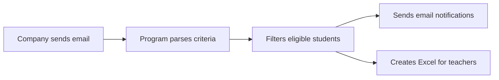

# 🚀 Automatic Placement Coordinator

<p align="center">
  
</p>

<p align="center">
  
  
  
  
  
</p>

---

## 💡 What is it?

> **Automatic Placement Coordinator** is an AI-powered automation tool that transforms the campus placement process by connecting recruiters, students, and faculty in a single, seamless workflow.

---

## 🎯 Key Features

- 📧 **Automated Email Parsing:** Instantly reads and extracts criteria from company emails.
- ⚡ **Smart Filtering:** Matches students to company requirements—no manual sorting!
- 📨 **Batch Notifications:** Personalized emails sent to eligible students.
- 📄 **Faculty Reports:** Summarized Excel reports sent directly to teachers.
- 🔒 **Secure Configurations:** Credentials and settings stay safe.
- 🧩 **Plug & Play:** Integrates easily with your datasets and email.

---

## 🛠️ Tech Stack

```python
Main Language : Python 3.x
Libraries     : pandas, openpyxl, smtplib, imaplib, email, re
Data          : Excel (.xlsx) files for student records
```

---

## 📦 Setup & Installation

```bash
# 1. Clone the repo
git clone https://github.com/Judethedude007/automatic-placement-coordinator.git
cd automatic-placement-coordinator

# 2. Install dependencies
pip install -r requirements.txt

# 3. Configure your settings
#    Edit config.py or .env for credentials and paths

# 4. Run the program
python main.py
```

---

## 🚦 Usage Flow



---

## 📝 Example Student Data

| Name     | Student_ID | Email             | Branch | CGPA  | Sex  | ... |
|----------|------------|-------------------|--------|-------|------|-----|
| Jude     | 100123     | jude@email.com    | IT     | 8.1   | M    | ... |
| ...      | ...        | ...               | ...    | ...   | ...  | ... |

---

## 🌟 Why Use This Tool?

- 🚀 **Saves Time:** No more manual filtering and notifications
- ✅ **Reduces Errors:** Fair, criteria-based selection
- 📢 **Improves Communication:** Nobody left out
- 🛠️ **Customizable:** Adapt to your workflow

---

## 📊 GitHub Stats

<p align="center">
  
  
</p>

---

## 🤝 Contributing

[](https://makeapullrequest.com)

- Fork the repo
- Create your feature branch (`git checkout -b feature/AmazingFeature`)
- Commit your changes (`git commit -m 'Add some AmazingFeature'`)
- Push to the branch (`git push origin feature/AmazingFeature`)
- Open a Pull Request

---

## 📧 Contact

- **Author:** [Judethedude007](https://github.com/Judethedude007)
- **Email:** [judethomas2004@gmail.com]

---

## ⭐️ Show Your Support

If you found this tool helpful, please ⭐️ the repository!

---

## 🛡️ License

This project is licensed under the [MIT License](LICENSE).

---

<p align="center"><b>Empowering placements, one automation at a time! 🚀</b></p>

---

## 💎 Extra: Add Your Own Flair!

- [ReadMe Typing SVG Generator](https://readme-typing-svg.demolab.com/)
- [Visitor Badge](https://visitor-badge.laobi.icu/)
- [GitHub Readme Stats](https://github.com/anuraghazra/github-readme-stats)
- [Shields.io Badges](https://shields.io/)
- [Mermaid Live Editor](https://mermaid.live/) for diagrams
